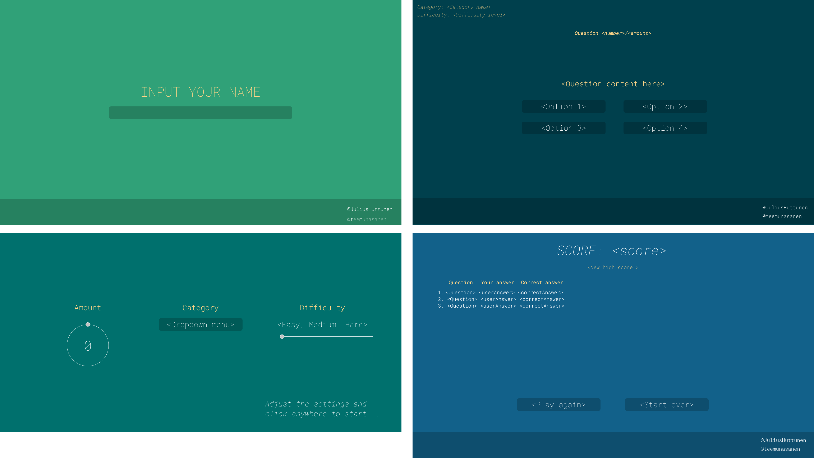

# trivia-game

[](https://github.com/RichardLitt/standard-readme)

The Trivia Game - Single Page Application with Vue.js framework version 3.x - Noroff Assignment 2

This project was programmed for the Noroff Full Stack Bootcamp. It was the main assignment of the Vue learning module.

## Table of Contents

- [Install](#install)
- [Usage](#usage)
- [Component tree](#components)
- [UI concept](#ui-concept)
- [Maintainers](#maintainers)
- [Contributing](#contributing)
- [License](#license)


## Install

Clone repository to local directory, navigate to project root and install.

```
   git clone https://github.com/teemunasanen/trivia-game.git
   cd trivia-game
   npm install
   
```

## Usage

The app is deployed at [Heroku.](https://trivia-game-vue3.herokuapp.com/)

For local installation, run this npm command in project root:

```
   npm run dev

```

## Components


## UI Concept




## Maintainers
[@JuliusHuttunen](https://github.com/JuliusHuttunen)
[@teemunasanen](https://github.com/teemunasanen)

## Contributing
[@JuliusHuttunen](https://github.com/JuliusHuttunen)
[@teemunasanen](https://github.com/teemunasanen)


Small note: If editing the README, please conform to the [standard-readme](https://github.com/RichardLitt/standard-readme) specification.

## License

MIT © 2022 Julius Huttunen & Teemu Näsänen
